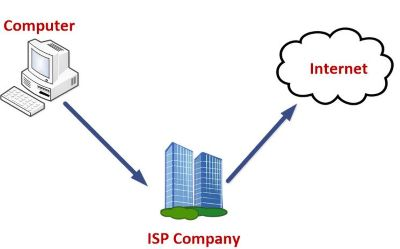

# Web Texnologiyalar

> ## Web texnologiyalar nima?
> * Biz har kuni foydalanadigan web saytlar, web dasturlarni ishlab chiqishda qo'llaniladigan va uni foydalanuvchiga yetkazib berishda ishlatiladigan dasturlarga web texnologiyalar deyiladi. 
> ## Internet
> * Internet -ma'lumot almashinish tarmog'i
> * Internet -ko'plab kompyuterlar ulangan tarmoq
> # Internetga ulanish (ISP)
> ## ISP(Internet Service Provider)
> 

- Web ilovalarning arxitekturasi
- Protokollar
- IP Domen URL Hosting
- DNS
- Web Server
- Frontend Backend **arxitekturasi**

This is really***very***important text.

> Dorothy followed her through many of the beautiful rooms in her castle.

> Dorothy followed her through many of the beautiful rooms in her castle.
>
> The Witch bade her clean the pots and kettles and sweep the floor and keep the fire fed with wood.

> Dorothy followed her through many of the beautiful rooms in her castle.
>
>> The Witch bade her clean the pots and kettles and sweep the floor and keep the fire fed with wood.

> #### The quarterly results look great!
>
> - Revenue was off the chart.
> - Profits were higher than ever.
>
>  *Everything* is going according to **plan**.

# Internet {#internet}
