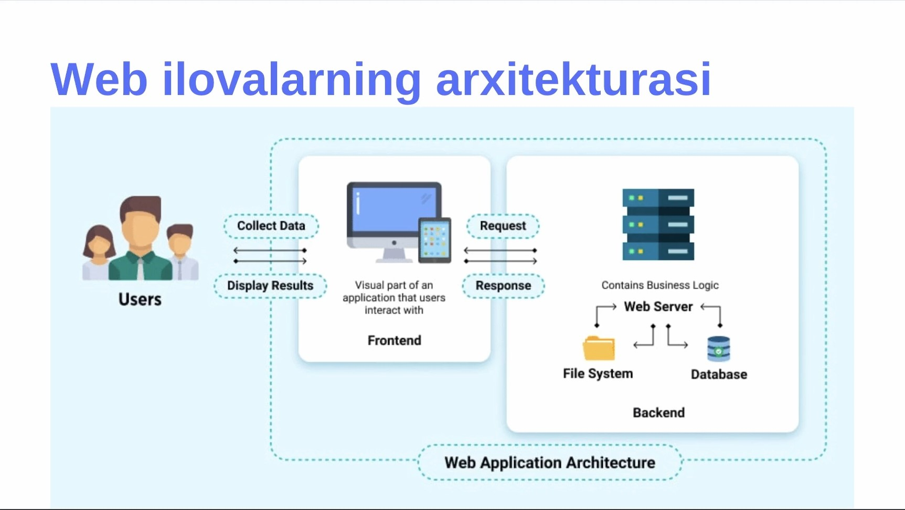
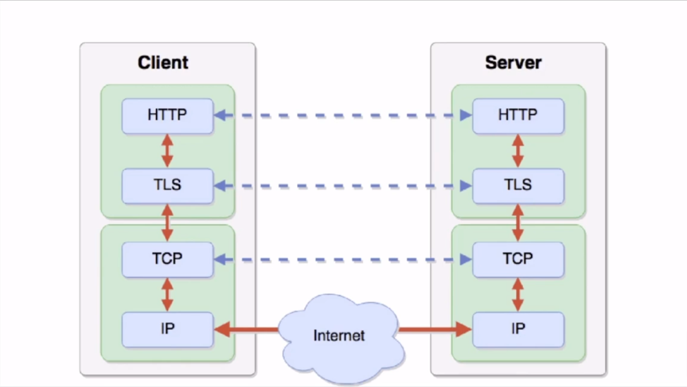
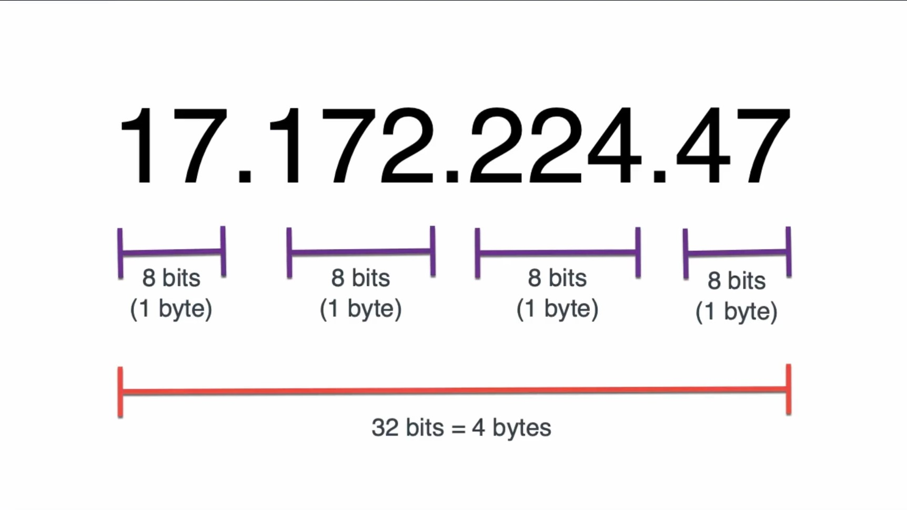
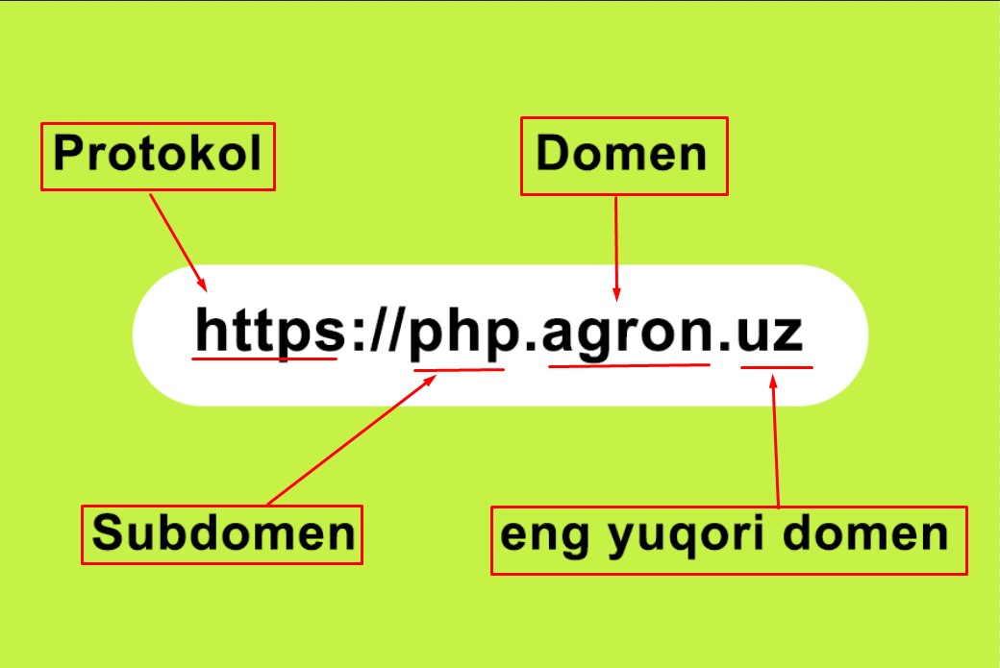
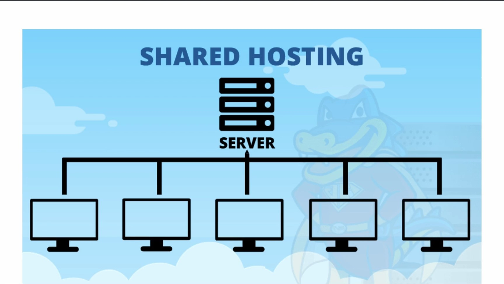
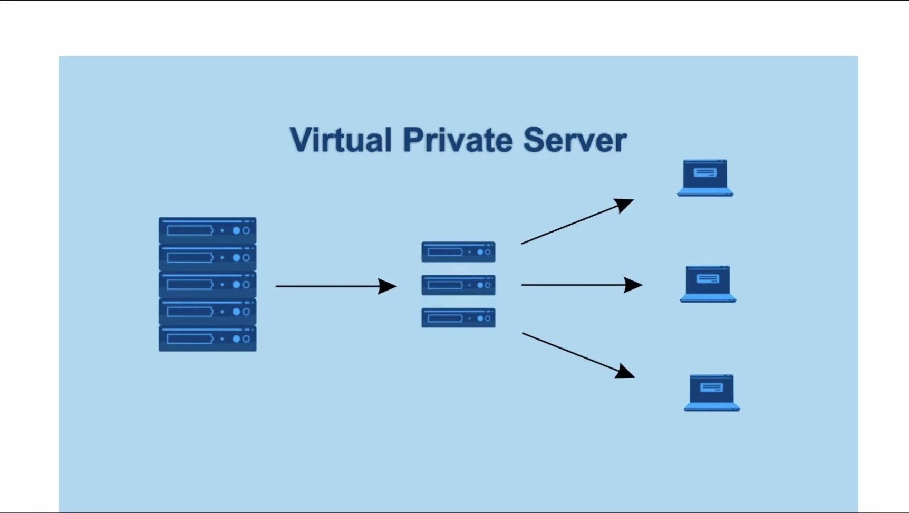
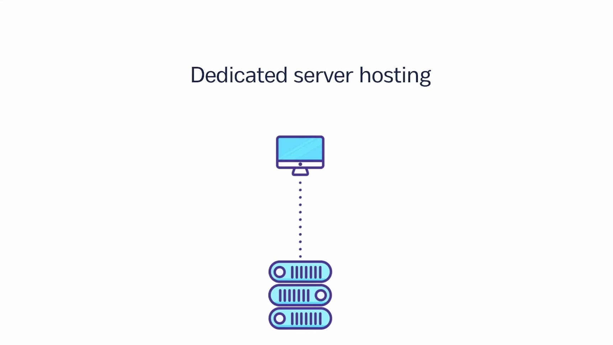
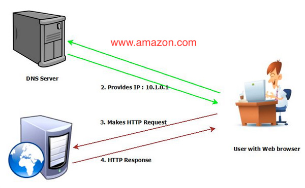

# Web Texnologiyalar
> O'tiladigan mavzularimiz
1. [Web Texnologiyalar](#Web-texnologiyalar-nima)
2. [Internet](#internet)
3. [Web ilovalarning arxitekturasi](#web-app)
4. [Protkollar](#protokol)
5. [IP, DOMEN, URL, HOSTING](#ip-domen-url-hosting)
6. [DNS](#DNS)
7. [Web Server](#web-server)
---------
## Web texnologiyalar nima?
> * Biz har kuni foydalanadigan web saytlar, web dasturlarni ishlab chiqishda qo'llaniladigan va uni foydalanuvchiga yetkazib berishda ishlatiladigan dasturlarga web texnologiyalar deyiladi. 
---------
## Internet {#internet}
> * Internet -ma'lumot almashinish tarmog'i
> * Internet -ko'plab kompyuterlar ulangan tarmoq
> # Internetga ulanish - ISP(Internet Service Provider)
> 
---------
## Web ilovalarning arxitekturasi {#web-app}
> 
---------
## Protokollar {#protokol}
> **Protokol** - ma'lumotlarni formatlash va qayta ishlash uchun standart qoidalar to'plamidir.
> * IP - Internet Protocol (Kompyuterdan kompyuterga ma'lumot o'tkazish uchun ishlatiladi)
> * TCP - Transmission Control Protocol (Kompyuterdagi dasturdan boshqa kompyuterdagi dasturga yuborish uchun ishlatiladi)
> * HTTP - Hypertext Transfer Protocol (Foydalanuvchi va Web Server o'rtasida HTML ma'lumotlarini almashinish uchun ishlatiladi)
> * TLC - Transport Layer Security (Internet orqali aloqa uchun ma'lumotlarni xavfsizligini ta'minlash uchun ishlatiladi)
> > 
---------
## IP, Domen, URL, Hosting {#ip-domen-url-hosting}
> ## IP nima?
> **IP(Internet Protokol)** - internet tarmog'idagi qurilmalarning takrorlanmas manzili hisoblanadi.
> > 
> ## Domen nima?
> **Domen** - web saytdan foydalanish uchun esda qoladigan, takrorlanmaydigan matn ko'rinishidagi manzil nomi hisoblanadi.
> > **Domenga misollar**
> > * [agron.uz](https://agron.uz)
> > * [webplaneta.uz](https://webplaneta.uz)
> > ## 
> ## URL nima?
> **URL** - internetdagi ma'lumotlarning aniq manzili hisoblanadi.
> > ### Misol uchun `http://example.uz:8080/path/data.html?a=1&b=2#part1`
> > * http - protokol nomi
> > * example.uz - domen nomi
> > * 8080 - TCP port
> > * /path/data.html - fayl yo'li
> > * a=1&b=2 - so'rov parametrlari
> > * #part1 - xatcho'p(langar), sahifadagi joylashuv
> ## Hosting nima?
> **Hosting** - web saytlarni internetda joylashtirish uchun xizmat hisoblanadi
> > 
> ### Hosting turlari (eng mashhur 3 tasi haqida)
> > 1. Shared hosting (Arzon)
> >   * Bitta serverda bir nechta web saytlar joylashishi mumkin, sizning saytingiz yonida yana bir nechta mijozlarning saytlari joylashgan bo'lishi mumkin
> > 
> > 2. VPS(*Virtual private server*) hosting (O'rtacha)
> >   * Bitta serverda bir nechta virtual serverlar hosil qilinadi, **Shared hosting**dan farqi siz uchun alohida virtual server yaratiladi unga faqat o'zingizni saytingizni joylashingiz mumkin.
> > 
> > 3. Dedicated hosting (Qimmat)
> >   * Bitta server faqat bitta mijoz uchun ishlatiladi.
> > 
---------
## DNS
> ## DNS nima?
> **DNS(Domain Name Server)** - Domen nomlari tizimi (DNS) Domen nomlarini IP manzillarga o'girib beradi.
> > 
---------
## Web Server {#web-server}
> ## Web server nima?
> **Web Server** - Foydalanuvchidan kelayotgan so'rovlarni (HTTP so'rovlarni) qabul qilib, tegishli javobni yuboradigan dastur hisoblanadi.
> ### Bu dasturlarga misollar;
> > * Apache(HTTP Server)
> > * NGINX
> > * IIS \
> > > 
