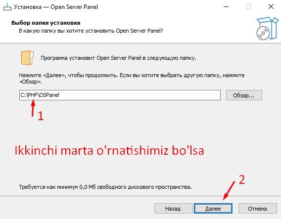
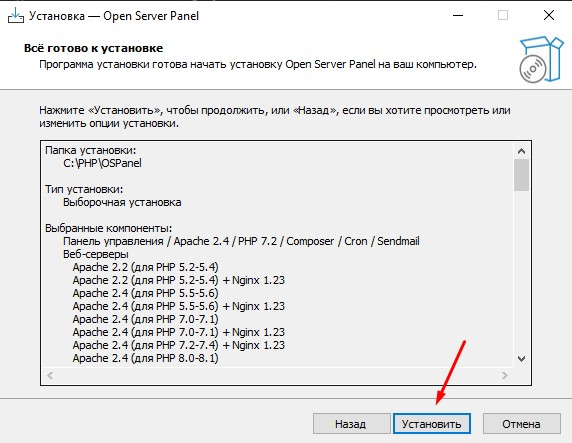

# 3-dars. Ish muhitini sozlash

> 1. Web Server(**_Apache_**, **_NGINX_**), PHP, MySQL haqida
> 2. Code editors(**Sublime Text**, **VSCode**, **PHPStorm**) haqida batafsil
> 3. Open Server bilan tanishish va uni o'rnatish
> > 
> > 
> > 
***

## 1. Web Server(**Apache**, **NGINX**), PHP, MySQL haqida

> ###  Web Server(*Apache*, *NGINX*) haqida
> > 
> > > 

> ### PHP haqida
> > - O'rganish oson
> > - katta hamjamiyat(community)ga ega
> > - internet tarmog'idagi web saytlarning 77.4% qismi PHP tayyorlangan [Statistika](https://w3techs.com/technologies/history_overview/programming_language/ms/y)
> > - CMSlar ko'p: Wordpress, 1C-Bitrix, Opencart...
> > - Frameworklari: YII, Laravel, Symfony...
> > - Barcha ma'lumotlar ba'zasi bilan ishlash oladi: MySQL, PostgreSQL, Oracle, MongoDB, SQLite...
> > - PHP ning web sayti: [https://php.net](https://php.net)

> ### Web Server haqida
> > #### OpenServer va XAMPP
> > > 
***

## 2. Tahrirlovchilar(**Sublime Text**, **VSCode**, **PHPStorm**) haqida batafsil

> ### *Sublime Text*
> > - Sublime text tahrirlovchilar ichida bepul va dasturlashni o'rganish qulay bo'lgan tahrirlovchi hisoblanadi.
> > - Sublime text dasturi tahrirlovchilar ichida eng kichik dastur hisoblanadi va uni ishlatish yengil barcha kompyuterlar ishlata oladi.
> > - Sublime text haqida yana ko'proq ma'lumot olish uchun [Sublime Text haqida](https://www.sublimetext.com/blog/).
> > - Sublime text dasturini yuklab olish uchun [Download Sublime Text](https://www.sublimetext.com/download "Sublime text download").

> ### *Visual Studio Code(VSCode)*
>> - VSCode tahrirlovchilar ichida bepul va dasturlashda kod yozish uchun qulay bo'lgan tahrirlovchi hisoblanadi.
>> - VSCode dasturini ishlatish uchun kompyuter tezkor xotirasi o'rtacha 8GB bo'lishi kerak aks holda kod yozishda qotishlar bo'lishi mumkin.
>> - VSCode dasturi tahrirlovchilar ichida bepul dastur va 1-o'rinda turadi.
>>> 
>> - VSCode dasturini yuklab olish uchun **_VSCode_** [Yuklab olish](https://code.visualstudio.com/Download "Visual Studio Code dasturini yuklab olish").

> ### *PHPStorm*
>> - PHPStorm pullik tahrirlovchi hisoblanadi.
>> - PHPStorm dasturi hajmi ancha katta va uni ishlatish uchun eng kamida 8GB tezkor xotira bo'lishi kerak.
>> - PHPStorm shunchaki kodni yozish emas balki uni xato joylarini to'g'rilash imkoni ham beradi.
>> - PHPStorm dasturini ishlatish birinchi 30 kun uchun bepul xizmat qiladi, keyin esa pullik.
>> - PHPStorm dasturini boshlang'ich o'rganuvchilarga ishlatish tavsiya berilmaydi.
>> - PHPStorm dasturini yuklab olish uchun **PHPStorm** [Yuklab olish](https://www.jetbrains.com/phpstorm/download "Boshlang'ich o'rganuvchilar uchun tavsiya qilinmaydi").
***

## 3. Open Server bilan tanishish va uni o'rnatish
> ### *Open Server*
>> - Open Server dasturi bizga darslarimiz davomida juda kerak bo'ladigan dastur hisoblanadi.
>> - Open Server dasturi ichida biz uchun kerakli barcha dasturiy mahsulotlar mavjud.
>> - Open Server dasturini yuklab olish uchun [Yuklab olish](https://ospanel.io/s/LKs_UtocFUt2k6ZlnfZ2nw/1684208552/open_server_panel_5_4_3_setup.exe).
>> - Open Server dasturini o'rnatishni boshlaymiz.
>>> 1. Dasturni ishga tushiramiz.
>>> 2. Davom etish(Далее).  .
>>> 3. 1-tanlab keyin, (Далее).  .
>>> 4. Davom etamiz.  .
>>> 5. Agarda birinchi marta o'rnatayotgan bo'lsak.  .
>>> 6. Agarda ikkinchi marta o'rnatayotgan bo'lsak, dastur o'rnatiladigan joyni o'zgartirib qo'yamiz(Обзор...).  .
>>> 7. Dasturni to'liq o'rnatish uchun.  
>>> 8. Dastur ichida ishlatmaydigan dasturiy ta'minotlarimizni olib tashlaymiz bular.
>>>> * PHP 5.2.
>>>> * PHP 5.3.
>>>> * PHP 5.4.
>>>> * PHP 5.5.
>>>> * MySQL 5.1.
>>>> * MySQL 5.2. 
>>>> 
>>> 1. Davom etamiz. 
>>> 2. Davom etamiz. 
>>> 3. Davom etamiz. 
>>> 4. Dasturni o'rnatib bo'ldik, endi kompyuterni qayta ishga tushiramiz. 
>> - Open Server dasturini darslarimizga kerakli qismlarini sozlab olishimiz kerak.

