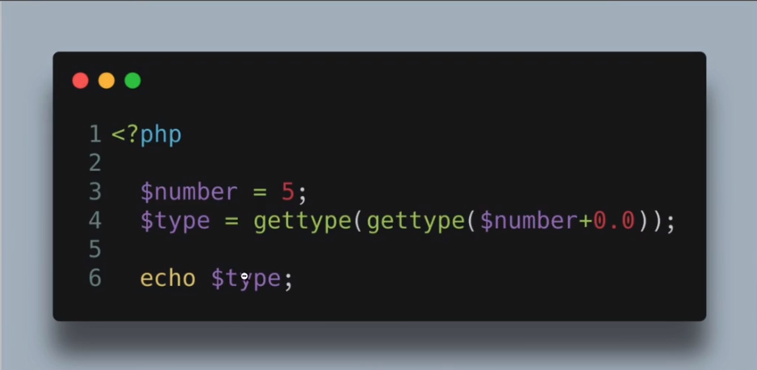

# 4-dars. Boshlang'ich tushunchalar

> ## Ushbu darsimizda;
> 1. PHP tili sintaksisi. Comments
> 2. O'zgaruvchilar, Constant
> 3. Ma'lumot turlari
***
> ## 1. PHP tili sintaksisi. Comment
> ### PHP aslida nima?
>> #### PHP - Hypertext Preprocessor
>> Web saytlarni tez va oson ishlab chiqishda va ma'lumotlar bazasi bilan ishlashda eng muqobil va mashhur hisoblanadi. 
>> Eng avvalo php qanday yaratilishi va uni sintaksisini ko'rib chiqamiz. Bizga kodlarimizni yozish uchun `index.php` fayli kerak bo'ladi.
>> Fayl yaratishda fayl_nomi.php ya'ni fayl nomidan keyin `.php` qisqartmasini qo'yishimiz kerak bo'ladi.

> ### PHP sintaksisi haqida
> PHP teglari `<?php ?>` barcha **_php_** kodlari ushbu teg ichida yoziladi;
> PHP da matnni ekranga chiqarish uchun ` "Assalom alaykum";` ko'rinishida yoziladi;
> Kommentariyaga olishning 3 xil usuli mavjud ular;
> 1. Bir qatorni commentga olish uchun `// comment ` ko'rinishida bo'ladi;
> 2. Bir qatorni commentga olishni ikkinchi usuli `# comment ` bo'ladi;
> 3. Ko'p qatorli matnni commentga olish uchun `/* comment */` bo'ladi;

> ### O'zgaruvchilar haqida
> PHP dasturlash tilida o'zgaruvchilar `$` belgilisi orqali yaratiladi;
> O'zgaruvchilarni yaratishda ro'xsat berilgan belgilar `[A-Z][a-z][ _ ]` ushbu belgilar orqali o'zgaruvchilar yaratiladi;
> O'zgaruvchini raqam `[0-9]` va boshqa belgilar `[-,@,!,#,%,^,&,*]` va hokazolar bilan yaratish mumkin emas;
> O'zgaruvchini to'g'ri yaratish `$matn` yoki `$_matn` ko'rinishida yaratamiz;

> ### Ma'lumot turlari haqida
> PHP dasturlash tilida ma'lumot turlari asosiylari bilan tanishib chiqamiz;
> * `"String"` - matn ko'rinishida bo'ladi;
> * `integer` - **2023** butun son ko'rinishida;
> * `float` - `20.5` qoldiqli sonlar ko'rinishida bo'ladi;
> * `boolean` - `true = 1` yoki `false = 0` ko'rinishida bo'ladi `true` = rost(1), `false` = yolg'on(0) qiymatni beradi;
> * `NULL` - hech qanday qiymatga ega bo'lmaydi;

> ### Ma'lumot turlarini tekshirish
> PHPda ma'lumot turlarini tekshirish uchun asosiy 2 ta funksiya mavjud;
> 1. `var_dump()` - O'zgaruvchini turini, belgilarini, qiymatini chiqarib beradi;
> 2. `gettype()` - O'zgaruvchini faqat turini tekshiradi;
> 3. `is_string()` - Ma'lumot turi matn ekanligini tekshiradi;
> 4. `is_integer()` - Ma'lumot turi butun son ekanligini tekshiradi;
> 5. `is_bool()` - Ma'lumot turi boolean ekanligini tekshiradi;
> 6. `is_null()` - Ma'lumot turi `NULL` ekanligini tekshiradi;

***

# Topshiriq

>> Ushbu rasmdagi kodning natijasida nima chiqadi.
>>> 